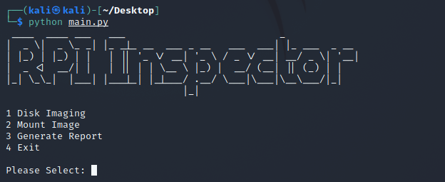

# RPI Inspector

**A tool that image and extract logs from Raspberry Pi.**

## Overview
**RPI Inspector** is a tool that image and extract logs from Raspberry Pi, written in Python3 for Kali Linux or any Debian-based machine that offers security researchers to image a Raspberry Pi’s memory card and mount it to generate reports from the logs.

This is a project made by [Raina](https://github.com/rainyraina), [Shu Fen](https://github.com/shufenlim), [Yan Jie](https://github.com/yanjiex-x) and [Yong Han](https://github.com/hammieee). A school project for [Singapore Institute of Technology](https://www.singaporetech.edu.sg/modules/2583?page=1) ICT2202 - Digital Forensics.

## Main Features
- Imaging the memory card
- Mounting the images including Fat32 and Ext file system
- Generating report for a specific duration to show suspicious activities on Raspberry Pi Os

## Supported Platform 
- Python3
- Operating System
  - a recent version of Linux (we tested on Kali Linux 2021.2);
  - Please note: Windows is not supported

## Installation & Documentation

- [User Manual](https://github.com/hammieee/ICT2202-Assignment1-RPIInspector/wiki/User-Manual)
